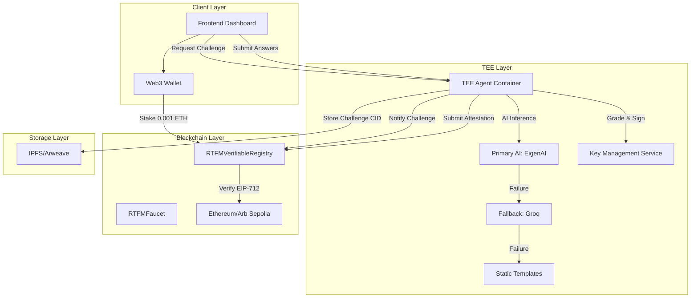
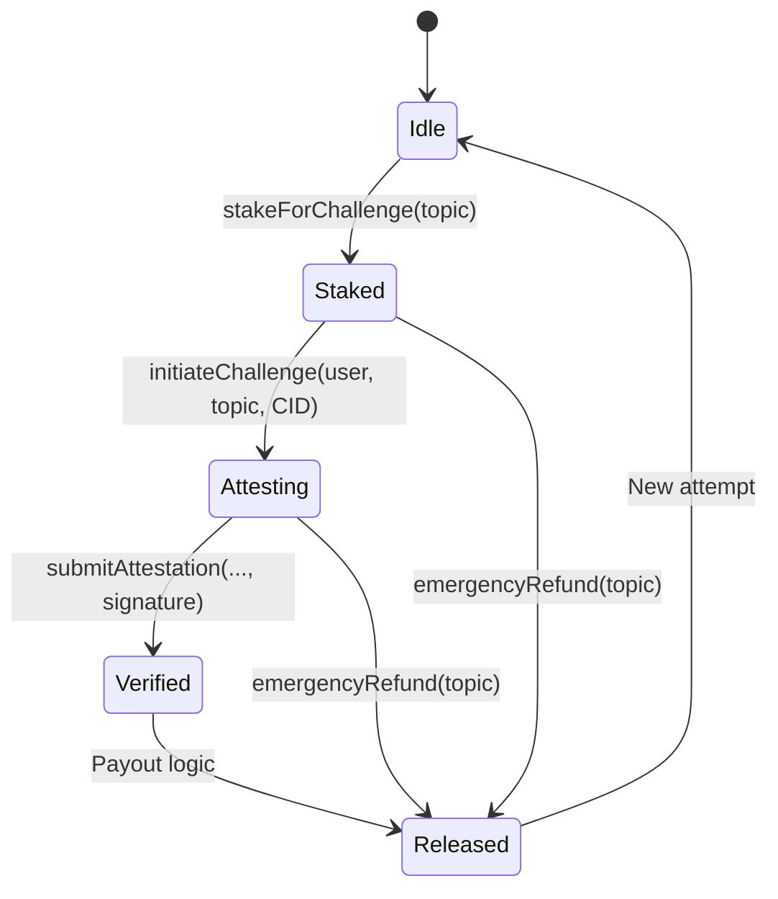
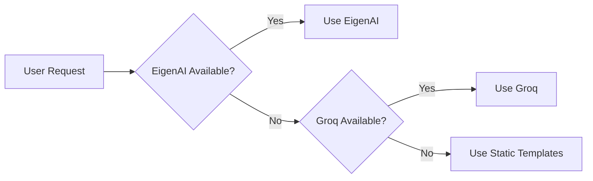
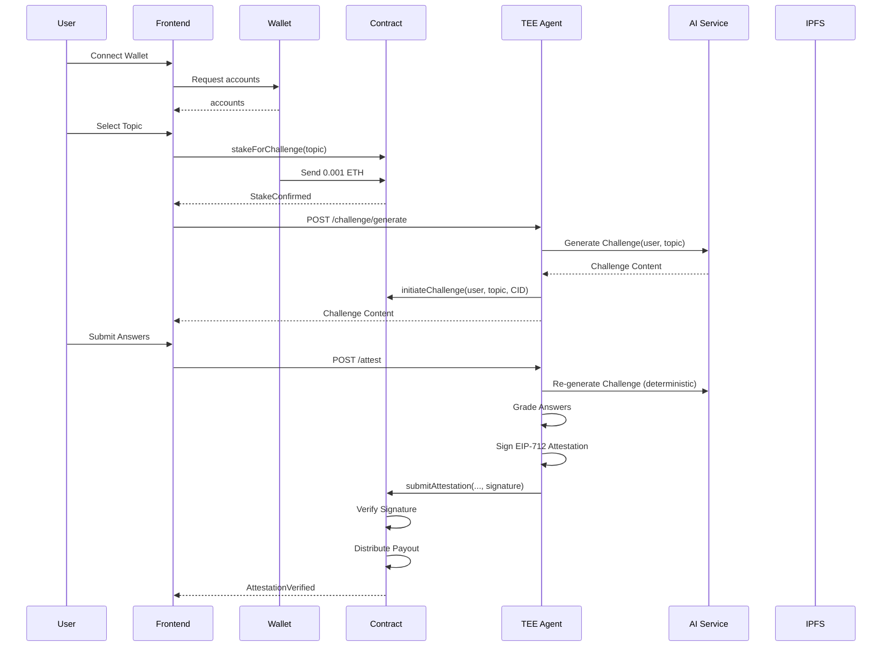
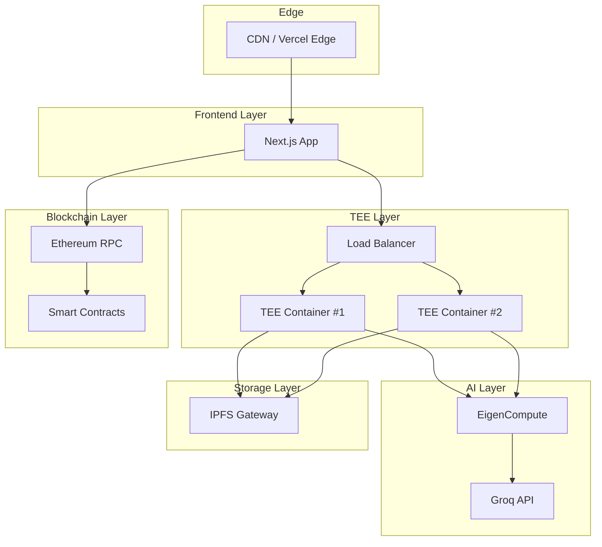

# Architecture Documentation

## System Overview

RTFM-Sovereign is a decentralized skill verification platform that combines **Trusted Execution Environments (TEEs)** with **Immutable Smart Contracts** to provide cryptographically verifiable attestations of user knowledge. The system enables users to stake funds, complete AI-generated challenges, and receive tamper-proof attestations stored on-chain.

### Core Components



### Technology Stack

| Layer | Technology | Purpose |
|-------|------------|---------|
| **Smart Contracts** | Solidity 0.8.24 | On-chain state machine, EIP-712 verification |
| **Frontend** | Next.js 15 + React | User interface, Web3 integration via Wagmi/Viem v2 |
| **TEE Runtime** | Node.js + Express | Attestation service, AI orchestration |
| **AI Services** | Cerebras SDK | Primary AI inference provider |
| **Cryptography** | ethers.js v6, ECDSA | EIP-712 signing, attestation verification |
| **Testing** | Foundry/Forge, Vitest | Contract tests, crypto tests |
| **Network** | Ethereum Sepolia | Deployment target |

## Trust Model

### Threat Assumptions

1. **Compromised AI Provider**: Primary AI (EigenAI/Cerebras) may return incorrect or malicious content
2. **TEE Operator Malice**: TEE container operator may attempt to manipulate attestation results
3. **Network Manipulation**: Attacker may intercept or replay network messages
4. **Smart Contract Bugs**: Contract may have vulnerabilities enabling economic exploits

### Trust Assumptions

1. **Intel SGX Attestation**: TEE enclaves provide cryptographic proof of code execution integrity
2. **EIP-712 Signatures**: TEE's private key is secure within the enclave; signatures are non-repudiable
3. **Ethereum Consensus**: Blockchain finality ensures immutability of on-chain records
4. **Circuit Breaker Logic**: Fallback AI providers ensure service availability under degraded conditions

### Trust Reduction Mechanisms

| Mechanism | Trust Reduced From | To |
|-----------|-------------------|---|
| **Deterministic AI Generation** | AI Provider randomness | On-chain verifiable seed |
| **EIP-712 Attestation** | TEE operator claim | Cryptographic signature |
| **Replay Protection** | Message replay attacks | Nonce-based validation |
| **Economic Stake** | Spam challenges | 0.001 ETH bond |
| **Emergency Refund** | TEE unresponsiveness | User-initiated timeout (7 days) |

## Component Deep Dive

### 1. Smart Contract: RTFMVerifiableRegistry

**File**: `packages/contracts/src/RTFMVerifiableRegistry.sol`

**Purpose**: Immutable state machine managing stake lifecycle, attestation verification, and economic distribution.

#### State Machine



#### Key Functions

| Function | Modifier | Purpose |
|----------|----------|---------|
| `enrollTEE(address, bytes)` | `onlyDeployer` | Propose new TEE public key |
| `activateTEE()` | `onlyPendingTEE` | Accept TEE role, renounce deployer |
| `stakeForChallenge(string)` | `payable` | User stakes 0.001 ETH |
| `initiateChallenge(address, string, bytes32)` | `onlyTEE` | TEE acknowledges challenge |
| `submitAttestation(...)` | `onlyTEE` | Submit signed attestation |
| `emergencyRefund(string)` | `nonReentrant` | Refund after timeout |
| `verifySkill(address, string)` | `view` | Query attestation status |

#### Constants

```solidity
uint256 public constant STAKE_AMOUNT = 0.001 ether;
uint256 public constant TIMEOUT_DURATION = 7 days;
uint256 public constant SCORE_THRESHOLD = 70;
uint256 public constant TREASURY_FEE_BPS = 2000; // 20%
```

### 2. TEE Agent Container

**File**: `apps/tee/src/server.ts`

**Purpose**: Orchestrate AI challenge generation, grading, and EIP-712 signing within trusted execution environment.

#### Core Services

| Service | File | Responsibility |
|---------|------|-----------------|
| `TEEIdentity` | `crypto/signer.ts` | Key generation, attestation quote |
| `ArchitectAgent` | `agents/ArchitectAgent.ts` | Generate AI challenges |
| `SpecialistAgent` | `agents/SpecialistAgent.ts` | Provide fallback answers |
| `CerebrasService` | `services/CerebrasService.ts` | Primary AI API client |
| `SwarmOrchestrator` | `orchestrator/SwarmOrchestrator.ts` | Circuit breaker logic |
| `GradingService` | `services/GradingService.ts` | Keyword-based scoring |
| `SignService` | `crypto/sign.ts` | EIP-712 signature generation |

#### REST Endpoints

| Endpoint | Method | Purpose |
|----------|--------|---------|
| `/identity` | GET | TEE public key + attestation quote |
| `/challenge/generate` | POST | Generate challenge (deterministic) |
| `/attest` | POST | Grade answers + sign attestation |
| `/health` | GET | Health check status |

#### Deterministic Challenge Generation

```typescript
seed = keccak256(userAddress || topic)
```

The seed is passed to the AI provider to ensure reproducible challenge generation for verification.

#### Circuit Breaker Pattern



Failure thresholds trigger cascading fallbacks to ensure service availability.

### 3. Frontend Application

**File**: `apps/web/app/sovereign/page.tsx`

**Purpose**: User interface for wallet connection, challenge display, and attestation submission.

#### Key Features

- **Web3 Integration**: Wagmi/Viem v2 for contract interactions
- **Wallet Connection**: MetaMask, WalletConnect support
- **Challenge Display**: Module-based question interface
- **Answer Submission**: Form validation and API communication
- **Attestation Verification**: On-chain result query

#### State Management

Zustand stores manage:
- Wallet connection state
- Challenge data
- Attestation results
- Loading/error states

## Data Flow

### Complete Challenge Lifecycle



### EIP-712 Attestation Structure

```solidity
// TypeHash
bytes32 constant ATTESTATION_TYPEHASH = keccak256(
    "Attestation(address user,string topic,uint256 score,uint256 nonce,uint256 deadline)"
);

// Encoded Message
structHash = keccak256(abi.encode(
    ATTESTATION_TYPEHASH,
    user,                              // address
    keccak256(bytes(topic)),           // bytes32
    score,                             // uint256
    nonce,                             // uint256
    deadline                           // uint256
));

// Signed Message
hash = _hashTypedDataV4(structHash);
signature = sign(hash); // TEE private key
```

## Security Properties

### 1. Confidentiality

- **TEE Enclave**: AI inference and grading occur within SGX-protected memory
- **Key Security**: TEE private key never leaves enclave
- **No Expected Keywords Leak**: Challenge generation sanitizes responses before sending to client

### 2. Integrity

- **Deterministic AI**: Challenge content verifiable via seed
- **EIP-712 Signatures**: Cryptographic proof of TEE attestation
- **On-chain State**: Attestation records immutable on blockchain

### 3. Availability

- **Circuit Breaker**: Primary AI → Fallback AI → Static Templates
- **Emergency Refund**: User can reclaim stake after 7-day timeout
- **Multi-region Deployment**: TEE containers can be deployed across multiple regions

### 4. Non-Repudiation

- **TEE Signature**: Attestations signed with TEE's unique key
- **On-chain Record**: Signature stored in contract state
- **Replay Protection**: Nonce-based validation prevents reuse

### 5. Economic Security

- **Stake Requirement**: 0.001 ETH discourages spam
- **Treasury Fee**: 20% fee incentivizes TEE operation
- **Penalty Mechanism**: 5% penalty for emergency refunds

## Deployment Topology

### Network Configuration

| Component | Network | Address |
|-----------|---------|---------|
| **RTFMVerifiableRegistry** | Sepolia (11155111) | `0x7006e886e56426Fbb942B479AC8eF5C47a7531f1` |
| **RTFMFaucet** | Sepolia (11155111) | `0xA607F8A4E5c35Ca6a81623e4B20601205D1d7790` |
| **TEE Service** | HTTP/HTTPS | TBD (deployed environment) |
| **Frontend** | HTTP/HTTPS | TBD (Vercel/Netlify) |

### Infrastructure Diagram



### Environment Variables

| Variable | Component | Required | Description |
|----------|-----------|----------|-------------|
| `CONTRACT_ADDRESS` | TEE | Yes | Registry contract address |
| `MNEMONIC` | TEE | No | Production key (if not using EigenCompute KMS) |
| `CEREBRAS_API_KEY` | TEE | Yes | AI provider API key |
| `RPC_URL` | Frontend | Yes | Ethereum RPC endpoint |
| `NEXT_PUBLIC_TEE_URL` | Frontend | Yes | TEE service endpoint |
| `NEXT_PUBLIC_CHAIN_ID` | Frontend | Yes | Chain ID (11155111 for Sepolia) |

### Monitoring & Observability

- **Health Checks**: `/health` endpoint on TEE service
- **Logging**: Pino logger with structured output
- **Error Tracking**: Sanitized error responses (no secrets leaked)
- **Metrics**: Challenge generation time, grading latency, success rates

## Scaling Considerations

### Horizontal Scaling

- TEE containers are stateless (except key material)
- Load balancer distributes requests across multiple instances
- IPFS CID ensures challenge content consistency

### Rate Limiting

- Frontend: Debounce user requests
- TEE: Per-user request throttling
- Contract: `stakeForChallenge` prevents spam via economic bond

### Cost Optimization

- **Static Templates**: Zero-cost fallback when AI services unavailable
- **Caching**: Challenge responses cached by seed
- **Batch Processing**: Multiple attestations submitted in single transaction

---

**Document Version**: 1.0  
**Last Updated**: 2026-02-22  
**Contract Version**: 1.0.0  
**Network**: Sepolia Testnet
