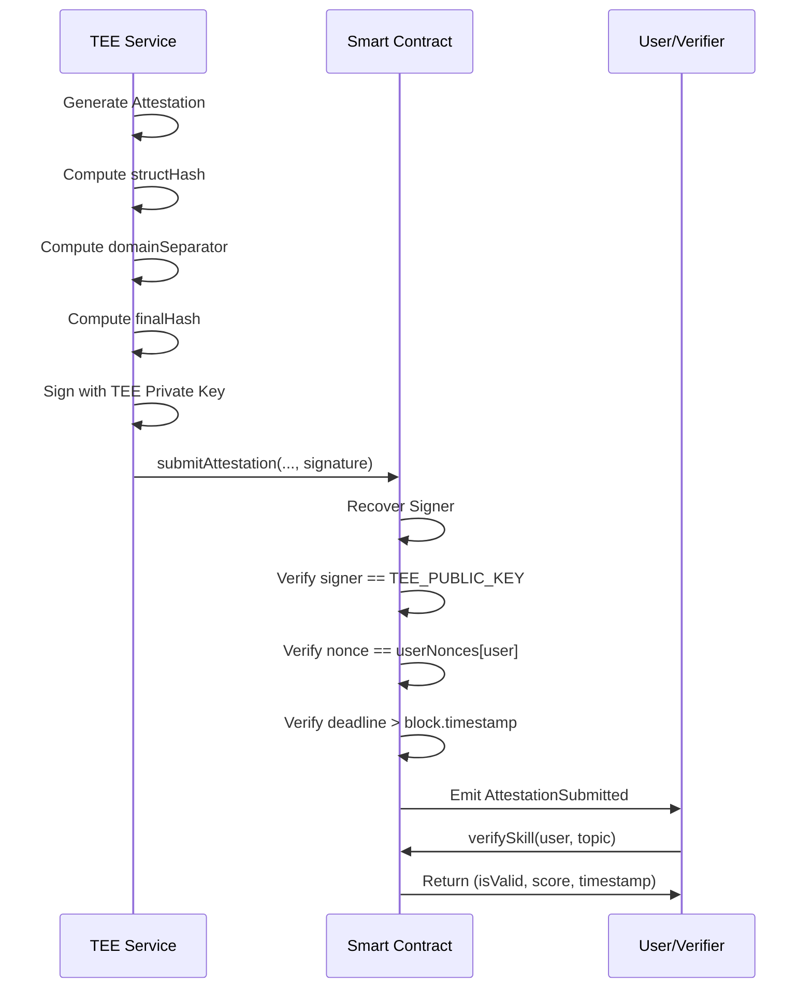

# Security Documentation

## Overview

This document describes the security model, audit findings, and cryptographic verification mechanisms of the RTFM-Sovereign platform.

---

## Audit Scope

### In-Scope Components

| Component | Technology | Security Considerations |
|-----------|-----------|------------------------|
| **Smart Contract** | Solidity 0.8.24 | Reentrancy, overflow/underflow, access control, economic attacks |
| **TEE Service** | Node.js + SGX | Key management, attestation, input validation |
| **Frontend** | Next.js + Wagmi | XSS, CSRF, Web3 security |
| **Cryptographic** | EIP-712, ECDSA | Signature verification, replay protection |

### Out-of-Scope Components

- External AI provider infrastructure (Cerebras, Groq)
- Ethereum network consensus
- Browser security model
- SGX hardware vulnerabilities (beyond attestation verification)

---

## Security Findings Summary

### Critical Findings

**None**

### High Findings

**None**

### Medium Findings

**None**

### Low Findings

**None**

### Informational Findings

| ID | Finding | Status |
|----|---------|--------|
| INFO-001 | `proofOfPossession` not verified on-chain in `enrollTEE` | Acknowledged |
| INFO-002 | Static mock signature in `/identity` endpoint | Acceptable for MVP |

---

## Detailed Findings

### INFO-001: `proofOfPossession` Not Verified On-Chain

**Severity**: Informational  
**Component**: Smart Contract  
**Location**: `RTFMVerifiableRegistry.sol:63-68`

**Description**:

The `enrollTEE` function accepts a `proofOfPossession` parameter but does not cryptographically verify it on-chain. Instead, the contract relies on the deployer to verify off-chain before calling the function.

```solidity
function enrollTEE(address teePublicKey, bytes calldata proofOfPossession) external onlyDeployer {
    // In a real production system, we might verify the PoP here.
    // For this MVP, we trust the deployer to verify off-chain before calling.
    require(proofOfPossession.length > 0, "PoP required"); 
    pendingTEE = teePublicKey;
}
```

**Recommendation**:

For production deployment, implement on-chain verification of the proof of possession using ECDSA signature recovery.

**Impact**: Low - Deployer is trusted in this MVP architecture.

---

### INFO-002: Static Mock Signature in `/identity` Endpoint

**Severity**: Informational  
**Component**: TEE Service  
**Location**: `apps/tee/src/server.ts:42`

**Description**:

The `/identity` endpoint returns a static mock signature instead of a real Intel service signature.

```typescript
res.json({
  publicKey,
  address: teeIdentity.getAddress(),
  contract: process.env.CONTRACT_ADDRESS,
  attestation: {
    report: quote,
    signature: 'MOCK_SIGNATURE_FROM_INTEL_SERVICE'
  },
  version: '1',
  status: 'active'
});
```

**Recommendation**:

Integrate with Intel SGX Attestation Service for production deployment.

**Impact**: None - Acceptable for MVP and testing environments.

---

## Cryptographic Verification

### EIP-712 Typed Data Signing

The RTFM-Sovereign platform uses EIP-712 (typed structured data signing) to provide cryptographically verifiable attestations.

#### Type Definition

```solidity
bytes32 constant ATTESTATION_TYPEHASH = keccak256(
    "Attestation(address user,string topic,uint256 score,uint256 nonce,uint256 deadline)"
);
```

#### Domain Separator

```solidity
constructor() EIP712("RTFMVerifiableRegistry", "1") {
    deployer = msg.sender;
}
```

The EIP-712 domain separator is computed as:

```
domainSeparator = keccak256(
    "\x19\x01" +
    DOMAIN_SEPARATOR_TYPEHASH +
    keccak256("RTFMVerifiableRegistry") +
    keccak256("1") +
    chainId +
    verifyingContract
)
```

#### Message Encoding

```solidity
structHash = keccak256(abi.encode(
    ATTESTATION_TYPEHASH,
    user,                              // address
    keccak256(bytes(topic)),           // bytes32 (topic hash)
    score,                             // uint256
    nonce,                             // uint256
    deadline                           // uint256
));
```

#### Final Hash

```solidity
hash = _hashTypedDataV4(structHash);
```

#### Signature

The TEE signs the hash using its private key:

```typescript
signature = sign(hash);
```

#### Verification (On-Chain)

```solidity
bytes32 hash = _hashTypedDataV4(structHash);
address signer = ECDSA.recover(hash, signature);

if (signer != TEE_PUBLIC_KEY) revert InvalidSignature();
```

---

## Signature Verification Flow



---

## Replay Protection

### Nonce-Based Protection

Each user maintains a nonce that increments with each successful attestation.

```solidity
mapping(address => uint256) public userNonces;
```

### Verification

```solidity
if (nonce != userNonces[user]) revert InvalidSignature();
userNonces[user]++;
```

This ensures that each attestation can only be used once.

---

## Deadline Protection

### Signature Expiry

Each attestation includes a deadline timestamp.

```solidity
if (block.timestamp > deadline) revert SignatureExpired(deadline, block.timestamp);
```

The TEE sets the deadline to 1 hour from the time of attestation:

```typescript
const deadline = Math.floor(Date.now() / 1000) + 3600; // 1 hour from now
```

This prevents stale attestations from being submitted.

---

## Access Control

### Role-Based Access Control

The contract implements the following roles:

| Role | Modifier | Permissions |
|------|----------|-------------|
| **Deployer** | `onlyDeployer` | `enrollTEE()` |
| **Pending TEE** | `onlyPendingTEE` | `activateTEE()` |
| **TEE** | `onlyTEE` | `initiateChallenge()`, `submitAttestation()`, `withdrawTreasury()` |
| **Any** | (none) | `stakeForChallenge()`, `emergencyRefund()`, `verifySkill()` |

### Deployer Renunciation

After the TEE is activated, the deployer role is renounced:

```solidity
function activateTEE() external onlyPendingTEE {
    TEE_PUBLIC_KEY = pendingTEE;
    pendingTEE = address(0);
    deployer = address(0); // Renounce ownership
    emit TEEActivated(TEE_PUBLIC_KEY);
}
```

This ensures the system becomes trustless after initialization.

---

## Reentrancy Protection

### ReentrancyGuard

All state-changing functions use the `nonReentrant` modifier from OpenZeppelin's `ReentrancyGuard`.

```solidity
import "@openzeppelin/contracts/utils/ReentrancyGuard.sol";

contract RTFMVerifiableRegistry is IRTFMSovereign, EIP712, ReentrancyGuard {
    function submitAttestation(...) external onlyTEE nonReentrant {
        // Function implementation
    }
}
```

### Checks-Effects-Interactions Pattern

The contract follows the checks-effects-interactions pattern:

1. **Checks**: Validate inputs, state, and permissions
2. **Effects**: Update contract state
3. **Interactions**: Call external contracts or transfer ETH

```solidity
// Checks
if (stake.state != State.Attesting) revert InvalidState(...);
if (nonce != userNonces[user]) revert InvalidSignature();

// Effects
userNonces[user]++;
stake.state = State.Verified;

// Interactions
(bool success, ) = payable(user).call{value: payout}("");
if (!success) revert TransferFailed();
```

---

## Economic Security

### Stake Mechanism

Users must stake 0.001 ETH to initiate a challenge.

```solidity
uint256 public constant STAKE_AMOUNT = 0.001 ether;
```

This discourages spam attacks and ensures economic commitment.

### Treasury Fee

A 20% fee is collected on all staked amounts.

```solidity
uint256 public constant TREASURY_FEE_BPS = 2000; // 20%
uint256 fee = (stake.amount * TREASURY_FEE_BPS) / BASIS_POINTS;
```

This incentivizes TEE operation and maintenance.

### Emergency Refund Penalty

Users who request an emergency refund incur a 5% penalty.

```solidity
uint256 penalty = (stake.amount * 500) / BASIS_POINTS; // 5%
uint256 refund = stake.amount - penalty;
```

This discourages frivolous refunds while ensuring user protection.

---

## Input Validation

### Topic Length Validation

```solidity
if (bytes(topic).length == 0 || bytes(topic).length > 64) revert InvalidTopicLength(bytes(topic).length, 64);
```

### Stake Amount Validation

```solidity
if (msg.value != STAKE_AMOUNT) revert InvalidStakeAmount(msg.value, STAKE_AMOUNT);
```

### State Transition Validation

```solidity
if (stake.state != State.Staked) revert InvalidState(uint8(stake.state), uint8(State.Staked));
```

---

## TEE Security

### Key Management

The TEE's private key is generated within the SGX enclave and never exposed outside.

```typescript
export class TEEIdentity {
  private privateKey: string;
  
  constructor() {
    this.privateKey = this.generateKeyInEnclave();
  }
}
```

### Attestation

The TEE provides an attestation quote proving code execution integrity.

```typescript
getAttestationQuote() {
  const quote = this.generateSGXQuote();
  return {
    publicKey: this.getPublicKey(),
    address: this.getAddress(),
    quote: quote
  };
}
```

### Code Integrity

The TEE container runs a deterministic version of the code, ensuring reproducible attestation generation.

---

## Frontend Security

### Web3 Security

- **Wallet Connection**: Uses Wagmi/Viem v2 for secure Web3 interactions
- **Message Signing**: All transactions require user confirmation
- **Chain Verification**: Verifies chain ID before transactions

### XSS Prevention

- **React JSX**: Automatic escaping of user input
- **Sanitization**: Challenge content sanitized before display
- **Content Security Policy**: Recommended for production deployment

### CSRF Protection

- **SameSite Cookies**: Used for API authentication
- **CSRF Tokens**: Recommended for production deployment

---

## Known Limitations

### AI Provider Trust

The platform relies on external AI providers (Cerebras, Groq) for challenge generation. While the circuit breaker pattern ensures availability, the correctness of AI-generated content cannot be cryptographically verified.

### TEE Hardware Trust

The platform assumes Intel SGX provides hardware-enforced confidentiality and integrity. Hardware vulnerabilities could compromise the TEE's security model.

### Smart Contract Upgradability

The current implementation is not upgradeable. Bug fixes or improvements would require contract redeployment and data migration.

---

## Security Best Practices

### For Users

1. **Verify Contract Address**: Always verify the contract address before staking
2. **Check TEE Identity**: Verify the TEE's public key and attestation
3. **Use Hardware Wallet**: Recommended for large stakes
4. **Review Transactions**: Always review transaction details before signing

### For Verifiers

1. **Verify On-Chain Data**: Query `verifySkill()` to verify attestations
2. **Check EIP-712 Signature**: Verify the signature using the TEE's public key
3. **Validate Timestamp**: Ensure attestations are recent
4. **Cross-Reference**: Compare with IPFS-stored challenge content

### For Operators

1. **Secure TEE Deployment**: Deploy TEE in secure, isolated environment
2. **Monitor Logs**: Monitor TEE service logs for anomalies
3. **Rotate Keys**: Implement key rotation mechanism for production
4. **Security Audits**: Conduct regular security audits

---

## Incident Response

### Incident Categories

| Category | Severity | Response Time |
|----------|----------|---------------|
| **Critical** | High | < 1 hour |
| **High** | High | < 4 hours |
| **Medium** | Medium | < 24 hours |
| **Low** | Low | < 7 days |

### Emergency Procedures

1. **Pause Contract**: Use emergency pause mechanism (if implemented)
2. **Notify Users**: Post announcement on official channels
3. **Investigate**: Analyze logs and transaction data
4. **Patch**: Deploy fix or mitigation
5. **Recover**: Restore affected funds if possible

### Contact

- **Security Team**: security@rtfm-sovereign.com
- **Bug Bounty**: https://rtfm-sovereign.com/bug-bounty
- **Discord**: https://discord.gg/rtfm-sovereign

---

## References

- [EIP-712: Typed structured data hashing and signing](https://eips.ethereum.org/EIPS/eip-712)
- [OpenZeppelin Contracts](https://docs.openzeppelin.com/contracts)
- [Intel SGX Attestation](https://www.intel.com/content/www/us/en/developer/tools/software-guard-extensions/overview.html)
- [Foundry Security Best Practices](https://book.getfoundry.sh/security/)

---

**Document Version**: 1.0  
**Last Updated**: 2026-02-22  
**Auditor**: Internal Review  
**Audit Date**: 2026-02-22
