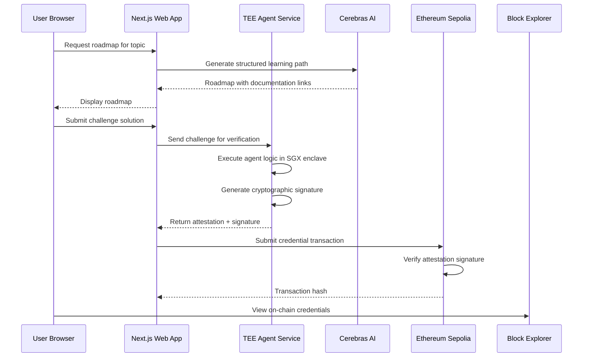

# RTFM-Sovereign Architecture

## System Overview

RTFM-Sovereign is a decentralized learning platform that combines:
- **RTFM-GPT**: AI-powered educational content generation
- **TEE Agents**: Verifiable execution on EigenCompute
- **Blockchain**: On-chain credential verification

## Data Flow Diagram



## Component Architecture

### 1. Frontend (apps/web)

**Responsibilities:**
- User interface and interaction
- Local state management (IndexedDB)
- API routing for TEE communication
- Challenge submission and display

**Key Technologies:**
- Next.js 16 App Router
- Tailwind CSS for styling
- Zustand for state management
- IndexedDB for offline-first storage

**Data Flow:**
```javascript
User Input
  ↓
Next.js API Routes
  ↓
TEE Agent Service (HTTP)
  ↓
Attestation Response
  ↓
Display to User
```

### 2. TEE Service (apps/tee)

**Responsibilities:**
- Execute agent logic in secure enclave
- Generate cryptographic attestations
- Sign verification outputs
- Communicate with Cerebras AI

**Key Technologies:**
- Node.js runtime on EigenCompute
- Gramine for SGX attestation
- ethers.js for signing
- Fastify/Express for HTTP server

**Security Model:**
- Code executes in hardware enclave
- Attestation provides proof of execution
- Private keys sealed in enclave memory

**Data Flow:**
```javascript
HTTP Request from Web
  ↓
Parse Challenge Input
  ↓
Execute Agent Logic (in SGX)
  ↓
Generate Attestation Report
  ↓
Sign with Sealed Key
  ↓
Return Response + Attestation
```

### 3. Smart Contracts (packages/contracts)

**Contracts:**

#### RTFMVerifiableRegistry.sol
- Stores verified credentials on-chain
- Verifies TEE attestations
- Links wallet addresses to achievements
- Prevents duplicate credentials

#### RTFMFaucet.sol
- Provides testnet ETH for new learners
- Time-based faucet with cooldown
- Prevents abuse

**Key Functions:**
```solidity
function verifyCredential(
    bytes calldata attestation,
    bytes calldata signature,
    bytes32 credentialHash
) external returns (bool)

function claimFaucet() external
```

**Security Considerations:**
- Only allow verified TEE attestations
- Reentrancy protection
- Gas optimization for low-cost verification

### 4. Shared Types (packages/types)

**Type Definitions:**
- `Attestation`: TEE attestation structure
- `Contract`: Smart contract ABIs and interfaces
- `Agent`: Shared agent types between web and TEE

## Security Architecture

### Threat Model

**Potential Threats:**
1. Fake attestations
2. Private key leakage
3. Replay attacks
4. Front-running

**Mitigations:**

1. **Fake Attestations:**
   - Verify SGX attestation report
   - Check measurement hash matches expected TEE code
   - Validate certificate chain

2. **Private Key Leakage:**
   - Keys sealed in enclave memory
   - Never exposed to untrusted code
   - HSM-level security via SGX

3. **Replay Attacks:**
   - Include nonce in each attestation
   - Timestamp validation
   - On-chain nonce tracking

4. **Front-running:**
   - Batch credential verification
   - Use commit-reveal scheme if needed

## Deployment Architecture

### Development Environment
- **Network**: Ethereum Sepolia Testnet
- **TEE**: Local Docker with Gramine simulation
- **RPC**: Alchemy/Infura endpoints

### Production Environment
- **Network**: Ethereum Mainnet (future)
- **TEE**: EigenCompute infrastructure
- **RPC**: Dedicated endpoints with fallback

## State Management

### Local State (IndexedDB)
- Roadmaps and progress
- Completed challenges
- User preferences

### On-Chain State
- Verified credentials
- Faucet claim history
- Reputation scores

### Hybrid Approach
- Local state for fast UI
- On-chain for verification
- Sync via periodic polling

## API Design

### Web → TEE API

**POST /api/verify**
```json
{
  "challengeId": "string",
  "solution": "string",
  "userAddress": "0x..."
}
```

**Response:**
```json
{
  "success": true,
  "attestation": "bytes",
  "signature": "bytes",
  "credentialHash": "0x..."
}
```

### Web → Blockchain

**Submit Credential**
```javascript
const tx = await registry.verifyCredential(
  attestation,
  signature,
  credentialHash
);
```

## Performance Considerations

### TEE Execution
- Parallelize multiple verifications
- Cache AI model responses
- Optimize enclave memory usage

### Blockchain Operations
- Batch multiple credential verifications
- Use gas-efficient data structures
- Implement L2 scaling for production

### Frontend
- Lazy load documentation pages
- Progressive rendering
- Service worker for offline access

## Monitoring & Observability

### Metrics to Track
- TEE attestation success rate
- Gas costs per verification
- User engagement (roadmaps completed)
- API response times

### Logging Strategy
- Structured JSON logs
- Log level filtering
- Sensitive data redaction
- Log aggregation (future)

## Future Enhancements

1. **L2 Integration**: Deploy to Polygon/Arbitrum for lower costs
2. **Social Verification**: Allow peer verification of credentials
3. **Credential Market**: Trading/selling verified credentials
4. **DAO Governance**: Community-driven challenge creation
5. **Multi-chain**: Support for multiple blockchain networks
